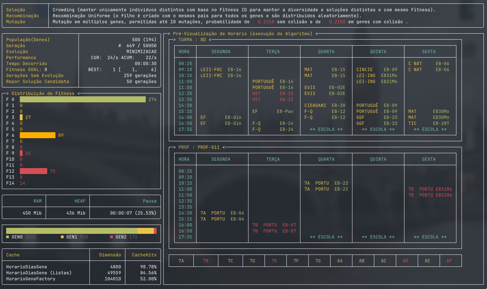

# 🏫 Algoritmo Genético: Escalonamento de Horários Escolares

Este projeto implementa um motor de **Algoritmo Genético (AG)** de alto desempenho, desenhado especificamente para resolver conflitos de horários em instituições de ensino. O sistema utiliza técnicas avançadas de gestão de memória e mutação heurística para convergir rapidamente para uma solução sem colisões.

---

## 📊 Dashboard e Observabilidade

Durante a execução, o sistema utiliza a biblioteca **Spectre.Console** para fornecer um painel de controlo visual e técnico, permitindo a monitorização em tempo real do progresso evolutivo.



### Informações Disponíveis em Tempo Real:

- **Distribuição de Fitness:** Apresenta um histograma dinâmico que reflete a distribuição da população. À medida que o algoritmo evolui, indicando como a população está a convergir para a solução ideal (Fitness 0).

- **Métricas de Cache:** Uma tabela detalhada que expõe a eficácia das fábricas/cache de pooling de genes. Taxas de **Cache Hits** elevadas (próximas de 100%) confirmam que a arquitetura está a reutilizar objetos com sucesso, poupando memória e reduzindo o overhead do sistema.

- **Pré-visualização Dinâmica:** O dashboard alterna automaticamente a cada **3 segundos** entre a visualização dos horários de diferentes Turmas e Professores. Isto permite validar visualmente a organização das aulas e a resolução de conflitos espaciais e temporais durante o processamento.

- **Saúde da Memória:** Monitorização em tempo real das recolhas do **Garbage Collector (GC)** e do consumo de RAM, garantindo que o motor se mantém estável mesmo em execuções longas com populações densas.

---

## 🚀 Arquitetura e Estratégia

A solução baseia-se num modelo de **Minimização de Conflitos**, onde o objetivo é atingir um Fitness de `0`.

### 🧠 Destaques Técnicos

- **Object Pooling (Flyweight):** Implementado via `HorarioGeneFactory` e `HorarioDiasGeneFactory`. Garante que genes idênticos partilhem a mesma referência em memória, otimizando o cache do CPU e reduzindo a pegada de RAM.
- **Mutação Cirúrgica:** Ao contrário de mutações aleatórias cegas, o sistema utiliza a flag `EstaEmColisao` para focar as alterações nos genes problemáticos.
- **Deteção de Conflitos Tripla:** Validação simultânea de **Professor**, **Turma** e **Sala** em slots temporais específicos.

---

## 📂 Requisitos de Dados (Pasta DATA)

Para que o motor arranque, é **obrigatória** a existência de uma pasta `./DATA` no diretório de execução contendo os seguintes ficheiros CSV:

- `horarios.csv`: Definição dos blocos temporais.
- `disciplinas.csv`: Cargas horárias e tempos letivos de cada unidade curricular.
- `disciplinas_salas.csv`: Salas permitidas por unidade curricular.
- `turmas.csv` & `turmas_horarios.csv`: Estrutura das turmas e as suas restrições.
- `turmas_disciplinas_professores.csv`: Vínculo entre turmas, docentes e disciplinas.
- `profs_horarios.csv`: Dados dos docentes e períodos de indisponibilidade.

---

## ⚙️ Configuração do Algoritmo

O sistema é altamente parametrizável através da classe `AGConfiguracao`. Exemplo de configuração utilizada (baseada no `Program.cs`):

```csharp
AGConfiguracao<HorarioCromossoma> agConfig = new AGConfiguracao<HorarioCromossoma>
{
DimensaoDaPopulacao = 100,
LimiteMáximoDeGeracoesPermitidas = 50000,
FitnessPretendido = 0f,
ReporSolucaoCandidataNaPopulacaoACadaGeracao = 50,
DarFeedbackACadaSegundo = 1,
ProcessoDeEvolucao = AGProcessoDeEvolucao.MINIMIZACAO,
ProcessoCalculoFitness = fitnessService,
ProcessoDeSelecaoDaProximaGeracao = selecaoService,
ProcessoDeRecombinacao = recombinacaoService,
ProcessoDeMutacao = mutacaoService,
ProbabilidadeDeSelecionarDaGeracaoPais = 0.25f,
ProbabilidadeDeSelecionarDaGeracaoFilhos = .75f,
CromossomaFactory = cromossomaFactory,
OutputService = outputService
};
```

## 🛠️ Compilação e Execução

Para garantir que o algoritmo opere com a máxima eficiência (especialmente as otimizações de memória e o pooling de genes), recomenda-se vivamente o uso do modo **Release**.

### Pré-requisitos

- **SDK do .NET 8.0** ou superior instalado no sistema.
- **Pasta de Dados:** É mandatório que exista uma pasta chamada `DATA` na raiz do diretório onde o executável será corrido, contendo os ficheiros CSV de configuração (`horarios.csv`, `disciplinas.csv`, `turmas.csv`, etc.).

### Passos para Compilar e Correr

1. **Restaurar as dependências:**
dotnet restore

2. **Compilar o projeto em modo Release:**
dotnet build -c Release

3. **Executar a aplicação:**
dotnet run -c Release --no-build

Se algum ficheiro na pasta DATA estiver em falta ou mal formatado, o sistema apresentará uma mensagem de erro detalhada e interromperá a execução de forma segura.

---

## 🗺️ Roadmap / Próximos Passos

O motor e este exemplo estão concluídos e funcionais. Ficam identificadas as seguintes extensões futuras para o caso de uso escolar:

- **Par pedagógico:** suporte para dois professores atribuídos à mesma turma/sala em simultâneo.
- **Gestão de deslocação entre escolas:** tempo mínimo de deslocação para professores que lecionam em várias escolas do mesmo agrupamento.
- **Eliminação de "buracos" no horário:** penalização de espaços vazios entre aulas na função de fitness.
- **Facilitação do preenchimento dos ficheiros estruturais:** ferramentas de apoio à criação/validação dos CSV de horários, professores, turmas e salas.

---

## 📄 Licença

Este exemplo está licenciado sob **GPL-3.0**, tal como o [motor de Algoritmo Genético](../../AlgoritmoGenetico) em que se baseia. Ver o ficheiro [LICENSE](../../LICENSE) na raiz do repositório.
